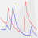
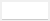
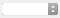
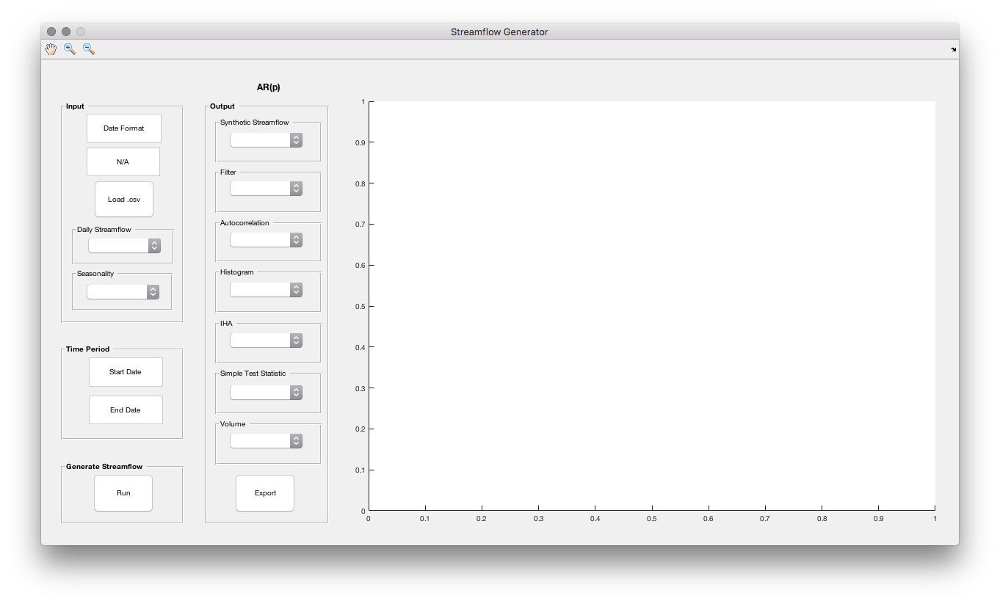
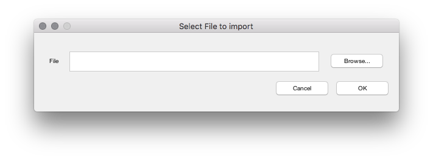
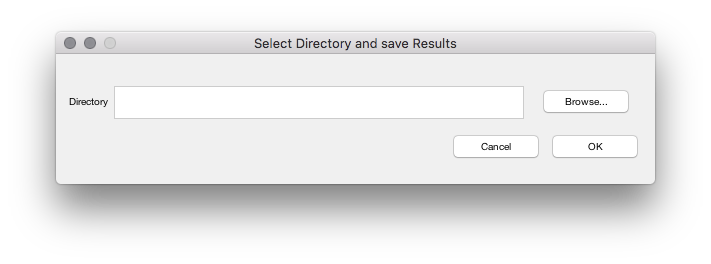

# Streamflow Generator (Qsynth) 

The **generator** synthesises an artificial streamflow time series with daily values based on autoregressive modeling. Its generation merely based on an observed streamflow time series. The implemented approach is aligned to Salas (1993)[1].

 In addition to Salas (1993)[1] a **filter** is applied to the time series resulting from the AR model to reduce the noise which occurs at low and medium flow rates. By applying a moving average with moving window size the noise is smoothed. It means that the window size is altering. The filter starts the lowest flow rate with a certain window size and decreases linearly until also a certain threshold for streamflow is reached after where the filter is not be applied anymore. To find the optimal starting window size and ending streamflow threshold both parameters are varied. For the different settings then the autocorrelation function (ACF) and the Indicators of Hydrologic Alteration (IHA)[2] (except Group 3) are calculated for the observed and the synthetic streamflow overlapping the same time period to form the difference. Subsequently the arithmetic mean of the difference for the ACF and the IHAs is calculated. Out of it the geometric mean is determined. The parameter set which minimizes the geometric mean is found to be optimal.
 
## How to cite

In case you use Qsynth in other software or scientific publications,
please reference the software. It can be cited
as:
    Razurel, P., Niayidar, A., Schwemmle, R and Perona, P.: Influence of
    Ecohydrological Indicators on Sustainable Flow Release Policies for
    Hydropower, Water Resources Management (in review), 2020.

## License

This software can be distributed freely under the GPL v2 license. Please read the LICENSE for further information.

© 2019, Robin Schwemmle (<robin.schwemmle@hydrology.uni-freiburg.de>) and Paolo Perona (<Paolo.Perona@ed.ac.uk>)

## Structure
* __[Installation](#installation)__
* __[Directions for Use](#directions-for-use)__
* __[Example](#example)__
* __[References](#references)__

## Installation
* **OS_Indenpendent:** Requires at least MATLAB R2016b. Additionally, you have to ensure that the econometric toolbox, curve fitting toolbox and the parallel computing toolbox are installed. MY_XTICKLABELS has also to be installed (can be installed via Add-On-Explorer in MATLAB). Run main.m to launch the GUI either from the MATLAB editor or the command window.
* **Windows:** Contains installer for Windows. Please follow the instructions in the installation setup.
* **Mac:** Contains installer for Mac. Please follow the instructions in the installation setup.

## Directions for Use

In order to generate an artificial streamflow time series with the Streamflow Generator the application is divided into four subroutines which need to be executed sequentially. Each subroutine is explained in more detail below. A rectangle  means that a manual input is required. The popup menu  is used to switch between the figures. On the top left you find a menu bar which you can use to navigate inside the figures.

---

 **Input**

`Date Format`: Indicate here the date format of your time series (e.g. dd/MM/yyyy).

`NA`: Indicate here the format of the missing values in your time series (e.g. N/A).

`Load .csv`: Imports with observed streamflow time series into the application. A new window pops up where the path to the .csv-file can be either entered manually or selecting it by browsing. Time series needs to start to 1 January and ends to a 31 December.

`Daily Streamflow`: Displays observed streamflow time series.

`Seasonality`: Daily and monthly runoff regime as well as parde coefficient are illustrated.

---

**Time Period**

`Start Date`: Indicate here the start date of the synthetic streamflow time series which will be generated.

`End Date`: Indicate here the end date of the synthetic streamflow time series which will be generated. Needs to end at a 31 December.

---

**Generate Streamflow**

`Run`: Generates the synthetic streamflow time series.

---

**AR(p)**

`p`: Autoregressive order used to generate the streamflow time series. Value gets updated after streamflow has been succesfully generated.

---

**Output**

`Synthetic Streamflow`: Displays generated streamflow time series with and without observed values.

`Filter`: Displays range of moving average with moving window size.

`Autocorrelation`: Displays autocorrelation for generated synthetic and observed streamflow time series entirely, for each month and for the residuals of the autoregressive model.

`Histogram`: Displays histogram for generated synthetic and observed streamflow time series entirely. Also shown the histogram the oserved time series after transformation to normal, after transformation to normal and standardization and the raw output of the autoregressive model. Additionally histogram of the residuals is plotted.

`IHA`: Displays the IHA (Indicators of Hydrologic Alteration) indicators of Group 1, Group 2, Group 4, Group 5-1 and Group 5-2 for the synthetic and observed streamflow.

`Simple Test Statistic`: Displays simple test statisic which compares the minimum, maximum, mean, standard deviation and skewness coefficient between synthetic and observed time series.

`Volume`: Displays the annually and monthly cumulated volume.

`Export`: Exporting all the plots as .pdf and the generated synthetic streamflow time series to .csv. A new window pops up where the path to the folder can be either entered manually or selecting it by browsing. All files will be exported to the indicated folder.

---
**Tool Bar**

Tools to navigate inside the plots.

: Pan

: Zoom in

: Zoom out

## Example

An example file how to use the generator is provided:

*example/example.csv*: File which contains an observed streamflow time series with daily values of 7 years used as input for the streamflow generator. May also be used what your input file has to look like. Otherwise the application will not be able to read the file. A blueprint is depicted in the table below.

> **Date**           | **Q**
> -------------------|------
> dd/mm/YYYY         | y1
> dd/mm/YYYY         | y2
> dd/mm/YYYY         | y3
>  ...               | ...

First define the date format and the missing value like below:

`Date Format` = dd/mm/YYYY

`NA` = N/A

Then import the provided example.csv. Before you generate the time series indicate the according start and end date like below:

`Start Date` = 01/01/1995

`End Date` = 31/12/2014

Now all fields are set and you are ready for generating. The output will be a synthetic time series containing 20 years of data.

## References

 [1]: Salas, J.D., 1993. Analysis and modeling of hydrologic time series. In: Maidment, D.R. (Ed.), Handbook of Hydrology. McGraw-Hill, pp. 1-72.

 [2]: Richter, B.D., Baumgartner, J.V., Powell, J., Braun, D.P., 1996. A method for assessing hydrologic alteration within ecosystems. Conservation Biology, 10(4): 1163-1174.
